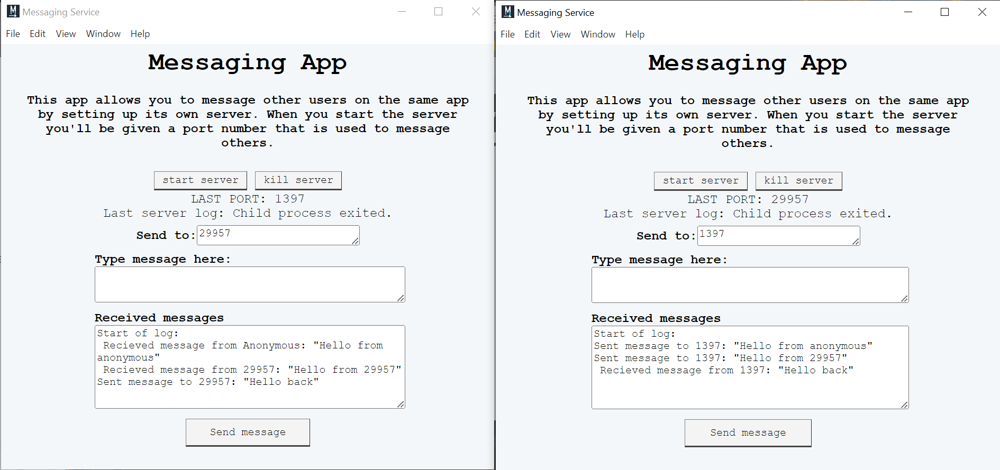
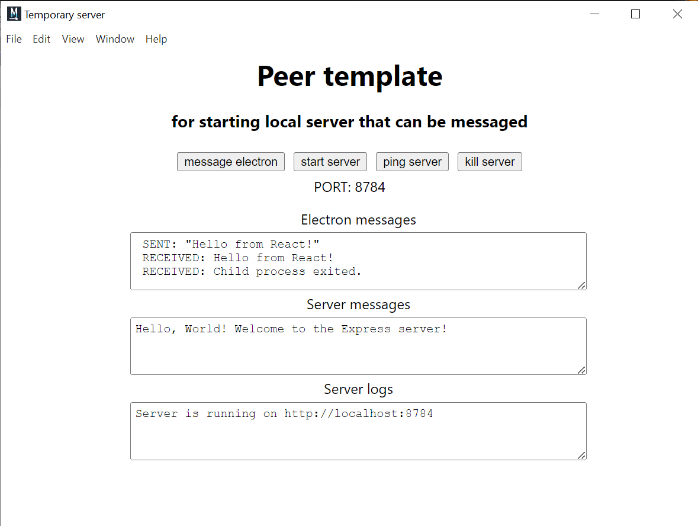
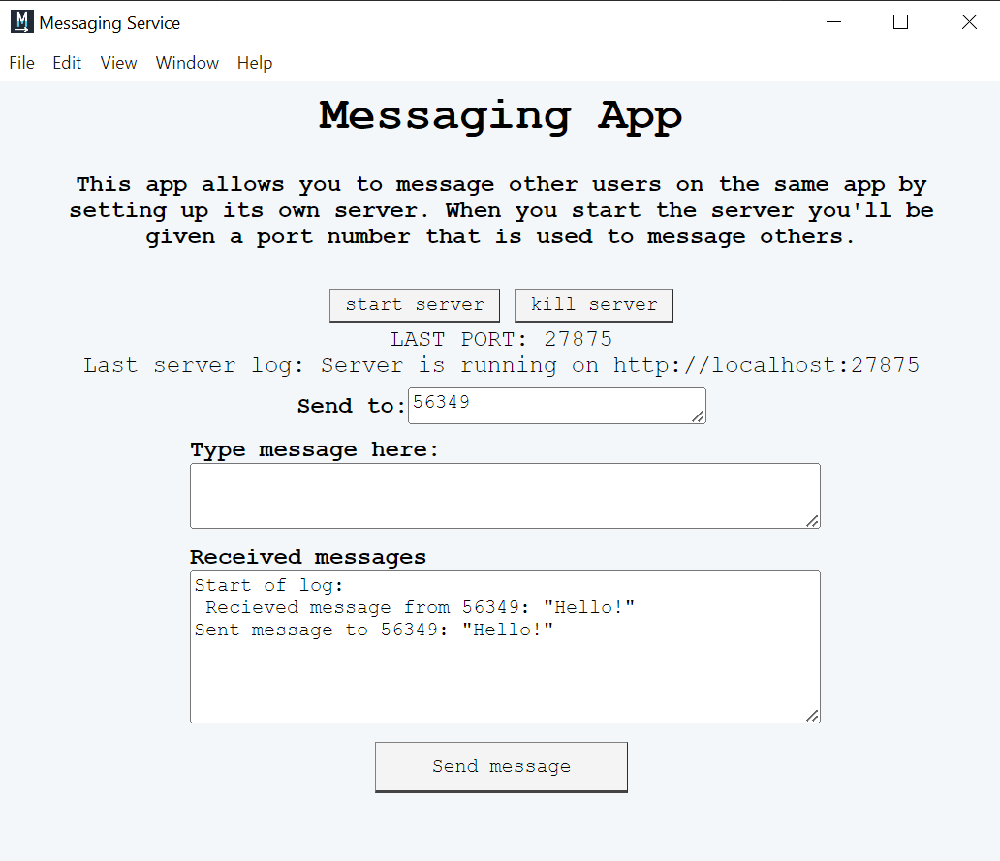

# 📶 Peer to peer website (kinda)

This repository contains <b>Electron app templates</b> that allow users to set up their own <b>peer-to-peer servers</b> directly from an app, eliminating the need for a centralised server.

## Setting up locally

- Navigate to the template(peer) or the messaging app(peer-message) folder.
- Run `npm i`.
- Run `npm start`.
- Open another terminal in the same folder.
- Run `npm run electron`, the app should start up.

If using the messaging app you can open another terminal and do the same, 
these windows will be able to message each other.

## Project structure

This repo is split into two parts:

### Peer

This is a <b>base template</b> for Electron apps that set up their own local servers.
Once running, users can start their own server and ping it through simple UI buttons.

The template is designed for easy extension, making it simple to build custom systems on top.
An example of this is peer-message, which extends this template to enable peer-to-peer messaging.

## Peer-message

This is the <b>messaging app</b>, an example of an extension of the template. It allows users to message each other using their own individual servers.

#### How It Works

1) The receiver must start their own server.
2) The sender enters the receiver’s port number in the "Send To" box.
3) The sender types a message in the "Type message here" box.
4) The sender presses "Send".
5) The receiver gets the message instantly.

This demonstrates a simple, decentralised messaging system—allowing communication without relying on a central server.

## Why Use This?

- No centralised server – Users host their own communication.
- Customisable – Extend the template to build more complex apps.
- Privacy-focused – Messages stay between peers with no direct middleman.